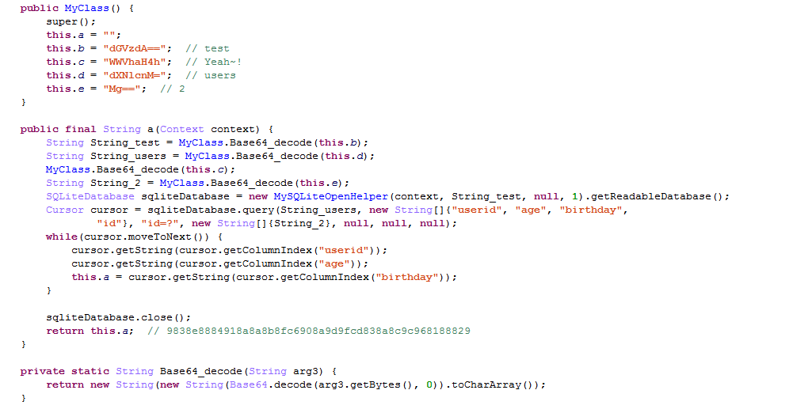
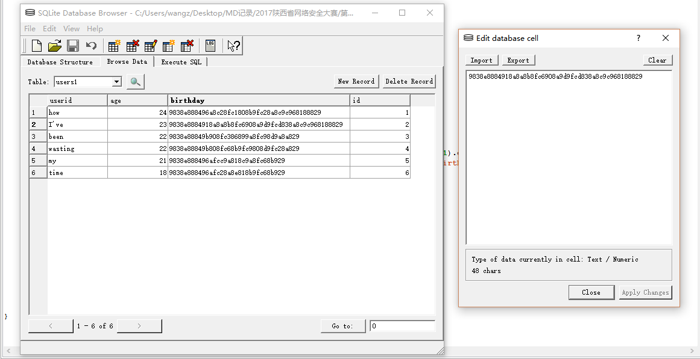
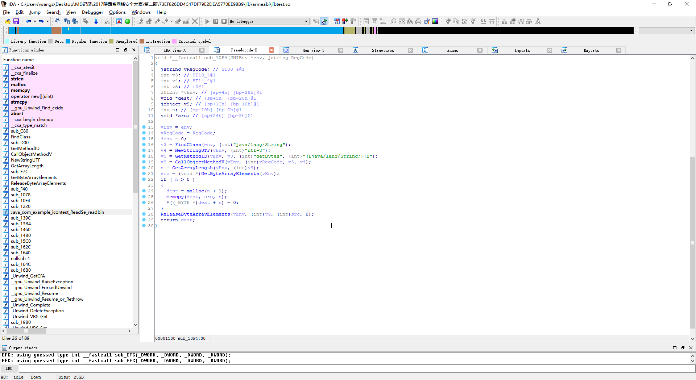
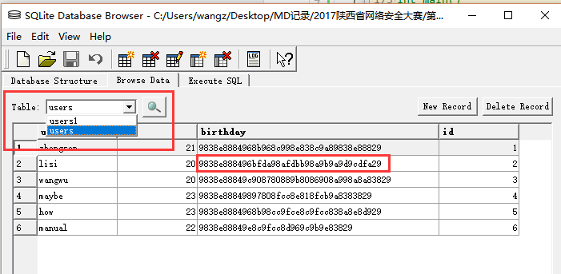

# 2017陕西省网络安全大赛Mobile第二题

**Author：wnagzihxain
Mail：tudouboom@163.com**

## 0x00 前言
混淆掉了一些函数名，耐心，耐心，耐心~~~

## 0x01 分析
Java层的混淆手动恢复一下即可


`readSec.checkRegCode()`函数两个参数分别是输入的注册码，还有一个通过另一个类来获取，具体是操作数据库，初步判断没有密码



这个值可以使用数据库查看工具来查看



那么接下来就是native层的计算了

native层混淆掉了各种系统函数，简单修复下参数类型，如下图所示
```
int __fastcall Java_com_example_icontest_ReadSe_readbin(JNIEnv *env, int a2, jstring RegCode)
{
    JNIEnv *vEnv; // ST0C_4@1
    int v4; // r0@1

    vEnv = env;
    sub_10F4((int)env, (int)RegCode);
    v4 = sub_1220();
    return sub_E04(vEnv, v4);
}
```

逐个函数分析，首先是`sub_10F4()`
```
void *__fastcall sub_10F4(JNIEnv *env, jstring RegCode)
{
    jstring vRegCode; // ST00_4@1
    int v3; // ST10_4@1
    int v4; // ST14_4@1
    int v5; // ST18_4@1
    JNIEnv *vEnv; // [sp+4h] [bp-28h]@1
    void *dest; // [sp+Ch] [bp-20h]@1
    int v9; // [sp+1Ch] [bp-10h]@1
    int n; // [sp+20h] [bp-Ch]@1
    void *src; // [sp+24h] [bp-8h]@1

    vEnv = env;
    vRegCode = RegCode;
    dest = 0;
    v3 = sub_CC4(env, (int)"java/lang/String");
    v4 = sub_E04(vEnv, "utf-8");
    v5 = sub_D5C(vEnv, v3, "getBytes", "(Ljava/lang/String;)[B");
    v9 = sub_DA8(vEnv, vRegCode, v5, v4);
    n = sub_E40(vEnv, v9);
    src = (void *)sub_EB8(vEnv, v9, 0);
    if ( n > 0 )
    {
        dest = malloc(n + 1);
        memcpy(dest, src, n);
        *((_BYTE *)dest + n) = 0;
    }
    sub_EFC(vEnv, v9, src, 0);
    return dest;
}
```

依旧各种看不懂，不过最下面的if分支很眼熟，强行猜测这是`GetStringUnicodeChars()`

经常分析的应该是很容易看出来，如果看不出来，再次跟进去，比如第一个
```
v3 = sub_CC4(env, (int)"java/lang/String");
--->
int __fastcall sub_CC4(JNIEnv *a1, int a2)
{
    return (*a1)->FindClass(a1, (const char *)a2);
}
```

第二个
```
v4 = sub_E04(vEnv, (int)"utf-8");
--->
int __fastcall sub_E04(JNIEnv *a1, int a2)
{
    return (*a1)->NewStringUTF(a1, (const char *)a2);
}
```

依次处理



这个就可以看出来是`GetStringUnicodeChars()`函数了

明显的，上层函数识别的不完整，不过没关系，我们双击下个函数进去后，上层函数自然就会修复了，就像这样，由于前面修复了部分函数的命名，所以最后返回的函数名也修复了
```
int __fastcall Java_com_example_icontest_ReadSe_readbin(JNIEnv *env, int a2, jstring RegCode)
{
    JNIEnv *vEnv; // ST0C_4@1
    const char *RegCode_chars; // r0@1
    char *v5; // r0@1

    vEnv = env;
    RegCode_chars = (const char *)GetStringUnicodeChars(env, RegCode);
    v5 = sub_1220(RegCode_chars);
    return NewStringUTF(vEnv, (int)v5);
}
```

从结构上来看，这个`sub_1220()`函数应该是关键的计算函数
```
char *__fastcall sub_1220(const char *RegCode_chars)
{
    signed int temp; // ST18_4@2
    int j_add_1; // ST10_4@2
    const char *vRegCode_chars; // [sp+4h] [bp-28h]@1
    signed int i; // [sp+Ch] [bp-20h]@1
    int j; // [sp+10h] [bp-1Ch]@1
    signed int vRegCode_chars_len; // [sp+14h] [bp-18h]@1
    char *src; // [sp+1Ch] [bp-10h]@1

    vRegCode_chars = RegCode_chars;
    vRegCode_chars_len = strlen(RegCode_chars);
    i = 0;
    j = 0;
    src = (char *)operator new[](2 * vRegCode_chars_len + 1);
    do
    {
        temp = vRegCode_chars[i];
        src[j] = sub_1078(~(_BYTE)temp & 0xF);
        j_add_1 = j + 1;
        src[j_add_1] = sub_1078((temp >> 4) ^ 0xE);
        ++i;
        j = j_add_1 + 1;
    }
    while ( i < vRegCode_chars_len );
    src[2 * vRegCode_chars_len] = 0;
    strncpy((char *)vRegCode_chars, src, 2 * vRegCode_chars_len + 1);
    return (char *)vRegCode_chars;
}
```

分析一圈，就中间两个计算最重要，大概的意思就是把一个字节的数据拆成前后各4位，然后再各种计算，逆着写代码太费劲，直接遍历可见字符，不管那么多了，一个字节最大0xFF，强行遍历到0xFF
```
#include <iostream>
#include <cstdio>
#include <cstring>
using namespace std;

signed char sub_1078(signed int a1)
{
    signed int v1; // r3@3

    if ( a1 > 9 || a1 < 0 )
    {
        if ( a1 <= 9 || a1 > 15 )
            v1 = 255;
        else
            v1 = (unsigned char)(a1 + 87);
    }
    else
    {
        v1 = (unsigned char)(a1 + 48);
    }
    return v1;
}

int main()
{
    char Key[] = "9838e888496bfda98afdbb98a9b9a9d9cdfa29";
    for(int i = 0; i < strlen(Key); i += 2)
    {
        for(unsigned char j = 0; j < 0xFF; j++)
        {
            if(sub_1078(~j & 0xF) == Key[i] && sub_1078((j >> 4) ^ 0xE) == Key[i + 1])
                printf("%c", j);
        }
    }
    printf("\n");
    return 0;
}
```

输出
```
flag{Y0uG0Tfutur3@}
```

刚开始发现怪怪的，因为输出的是`flag{need your blessing}`

后来发现表搞错了。。。。。。



## 0x02 小结
暴力大法好~~~

